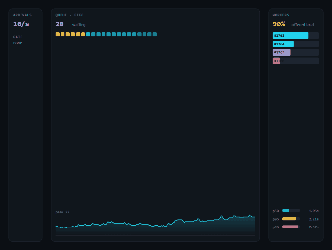
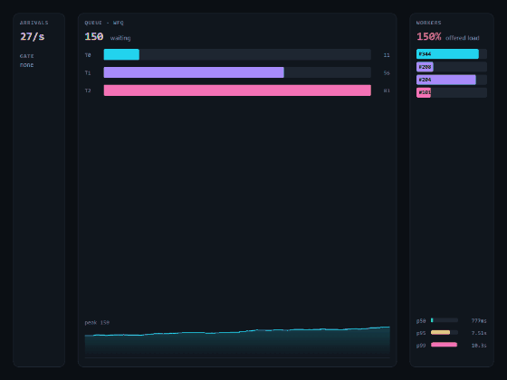

<div align="center">

# queueviz

**Watch the behaviour that actually decides your tail latency.**
Queue disciplines, backpressure, rate limiting and fair queueing — simulated, animated, and reproducible.

[](https://github.com/why-xdd/queueviz/actions/workflows/ci.yml)


### [**Open the live simulation →**](https://queueviz.vercel.app)

<a href="https://queueviz.vercel.app"></a>

*Recorded from the running page at 90% load — the preset called **the knee**.*

</div>

---

Queueing theory is taught as algebra and experienced as an outage. The formulas
are correct and almost nobody develops an intuition from them — but ten seconds
of watching a queue build at 95% load, and then watching it *not* build once
backpressure is switched on, is very hard to forget.

That is all this is: a real simulation, running at 60 fps, with the knobs
exposed. It runs at **[queueviz.vercel.app](https://queueviz.vercel.app)** —
nothing to install to try it.

```bash
npm install && npm run dev   # or run it locally
```

---

## The seven presets, and what each one shows

Every preset is one idea, visible in under ten seconds.

| preset | the point |
|---|---|
| **Healthy** | 50% load. The queue stays near empty, latency *is* service time. |
| **The knee** | 90% load. Nothing is "overloaded", yet p99 is already several times p50. This is the curve everyone plans capacity straight past. |
| **Collapse** | Above 100% with an unbounded queue. Latency grows without limit — not to a high value, but *forever*. |
| **Backpressure** | The same overload, bounded queue. Some requests are dropped and the rest stay fast. |
| **Token bucket** | A burst allowance that refills, so quiet clients can spike without sustained load getting through. |
| **Noisy neighbour** | Weighted fair queueing: one tenant floods their own lane and nobody else's. |
| **Starvation** | Strict priority. Urgent work flows freely; the low-priority queue grows forever. |

### The comparison worth internalising



Under identical overload, FIFO puts every tenant in one line — so the tenant
sending ten times the traffic makes *everyone's* latency ten times worse.
Weighted fair queueing gives each their own lane. Above, the lanes hold visibly
different depths: the tenant with the largest weight drains fastest and stays
short, while the lightest one accumulates its own backlog. The heavy user is
throttled into their own queue, and the quiet ones are not waiting behind it.

That is what "noisy neighbour isolation" means, and it is far more convincing as
three coloured bars than as a paragraph.

---

## What is simulated

**Arrivals** are a Poisson process — gaps between requests are exponentially
distributed, so traffic *clumps*. Those clumps are the entire reason queues form
at average loads well below capacity. A simulation with evenly spaced arrivals
would hide the only phenomenon worth showing.

**Service times** are log-normal-ish rather than fixed, because real work has a
long right tail, and a symmetric distribution understates the p99 that dominates
everything.

**Disciplines**

- **FIFO** — everyone waits in proportion to how busy things were when they
  arrived. Fair, and under overload uniformly slow.
- **LIFO** — serves the newest request, whose caller is most likely still
  waiting. FIFO instead spends the server on requests that have already timed
  out client-side: work delivered to nobody. The cost is an unbounded tail, and
  you can watch the bottom of the stack starve.
- **Priority** — a binary heap, FIFO within each band. Watch the low-priority
  queue grow forever once the urgent stream alone can saturate the workers.
- **Weighted fair queueing** — deficit round robin across per-tenant queues.

**Admission control**

- **Bounded queue** — depth × service time *is* your worst-case latency, so
  choosing a queue depth is choosing a latency SLO. A far more meaningful thing
  to reason about than "how much memory can we spare".
- **Token bucket** — sustained rate plus burst. Refills *continuously*, not on a
  timer: stepwise refill makes clients synchronise onto the tick and produces
  exactly the thundering herd the limiter exists to smooth.
- **Leaky bucket** — a strictly constant output rate, no burst at all. Same
  average throughput as the token bucket, completely different shape. Switch
  between them under load to see it.

---

## Reproducible by construction

Everything stochastic draws from a seeded generator, so the same settings always
produce the same trace. You can show someone the interesting thing you just saw,
and a failing test can be re-run.

`Math.random()` cannot be seeded, which would have made both impossible.

---

## Tests

```bash
npm test        # 40 tests
npm run build   # typecheck + bundle
```

The simulation is pure TypeScript with no DOM in it, so it is tested directly
rather than through the UI. The suite pins the behaviours a renderer would never
reveal:

- **Requests are conserved**: `arrived === dropped + completed + in flight`,
  after thousands of steps. This one assertion catches almost any bookkeeping
  bug in the engine.
- **Backpressure lowers p99 without costing throughput** — the entire argument
  for shedding load, as a comparison between two runs on the same seed.
- **Fair queueing serves a quiet tenant early** even when a noisy one has 100
  requests queued ahead.
- **The priority heap keeps its invariant** across 500 random pushes, and stays
  FIFO within a band — otherwise two identical requests get wildly different
  latencies.
- **A background tab must not fast-forward the world.** `requestAnimationFrame`
  stops when hidden; an unclamped delta would advance the simulation by minutes
  in a single frame.
- **Every arrival in a frame is admitted**, not just the first — a single check
  per step silently caps the arrival rate at the frame rate.
- **A token bucket refills continuously**, and never banks more than its
  capacity.

One test caught a real measurement bug: the rate counter averaged over the whole
window *including the second still in progress*, under-reporting throughput by a
steady 20%. The system read as never quite keeping up when it was keeping up
exactly.

---

## Build

```
dist/index.html   3.4 kB │ gzip: 1.2 kB
dist/index.css    5.3 kB │ gzip: 1.6 kB
dist/index.js    26.2 kB │ gzip: 8.5 kB
```

No runtime dependencies. No framework, no chart library, no canvas wrapper —
about 1 200 lines of TypeScript, of which the simulation is roughly half.

The canvas scales to `devicePixelRatio`, which is the difference between a
visualisation that looks designed and one that looks blurry next to the DOM
around it.

---

## Accessibility

`Space` pauses · `R` resets · every control is reachable by tab, with visible
focus rings and `aria-checked` on the segmented groups. The live figures are
real DOM text in the stat strip, not only pixels on the canvas, so a screen
reader gets the numbers.

Every pointer target clears 44x44 (WCAG 2.5.8) and every label clears 4.5:1
against its surface (WCAG 1.4.3) — the caption colour measured 3.11:1 before an
audit caught it, which quietly failed AA across the entire interface.

**Reduced motion is handled by pausing, not by dimming.** A 60fps canvas is the
one thing on this page CSS cannot tone down, so a visitor whose system asks for
reduced motion gets the simulation stopped on arrival, with the Play button and
a line of copy explaining why. Hover and focus transitions shorten rather than
disappear: a control that snaps between states is harder to follow, not easier.

## Layout

The canvas composes itself from its own width, watched with a `ResizeObserver`
rather than a window listener — measuring once at startup can capture a size the
layout has not settled on, and nothing corrects it afterwards.

Above 560px the three panels read left to right. Below it the same pipeline
turns vertical, and the workers collapse from individual progress bars to a row
of slots, because the panel is no longer tall enough to hold both those and the
latency read-out.

An earlier version simply squeezed the columns. Below about 370px the queue
column computed to a *negative* width, `arcTo` threw on the negative corner
radius, and — since the next frame was requested at the end of the frame
function — the simulation stopped forever. On a phone the page showed one panel
and froze. Both halves are fixed: the layout stacks, and the frame is scheduled
before the work so one bad frame costs one frame.

MIT © [why-xdd](https://github.com/why-xdd)
